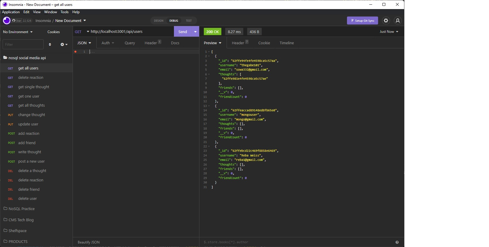

# Gabe-NoSQL-Challenge-Social-Network-API

## Video Walkthrough Link:

## Table of Contents

- [Description](#description)
- [Installation](#installation)
- [Usage](#Usage)
- [Bugs](#Bugs)
- [Screenshots](#screenshots)
- [Credits](#credits)

## Description

This was a back-end project focused on creating the supporting database for a social media app API.

-
-
-
-

## Installation

-

## Usage

-

## Bugs

-

## Screenshots

- 
- 
- 
- 
- 

## Credits

- This project could not have been completed without the hardwork and excellent advice of my educators at UW Fullstack and tutor, Jacob Carver.
